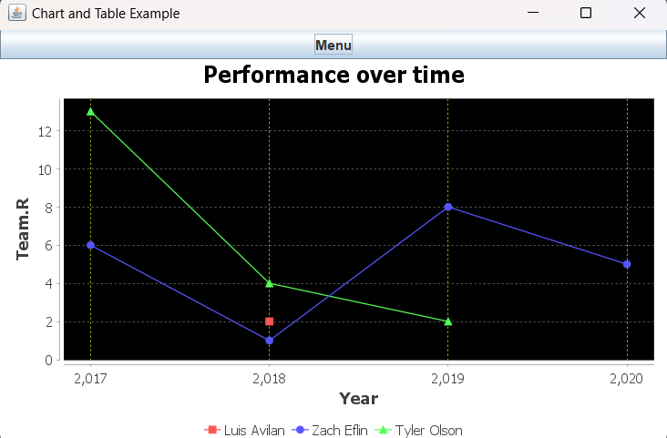
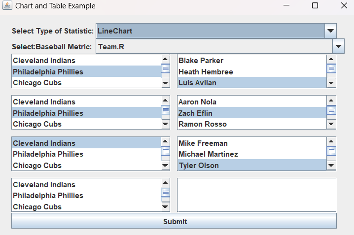
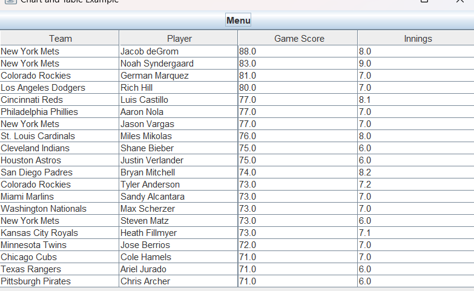
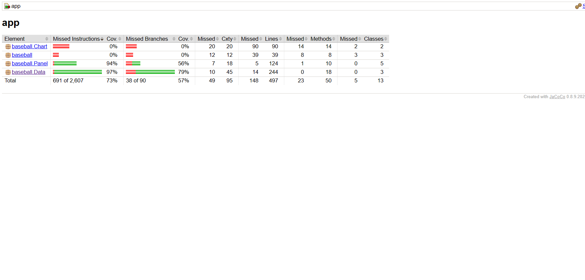
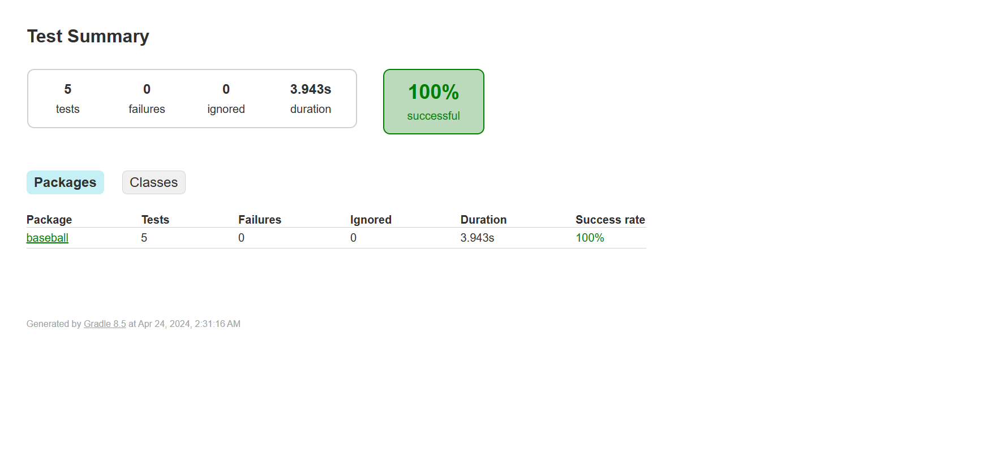
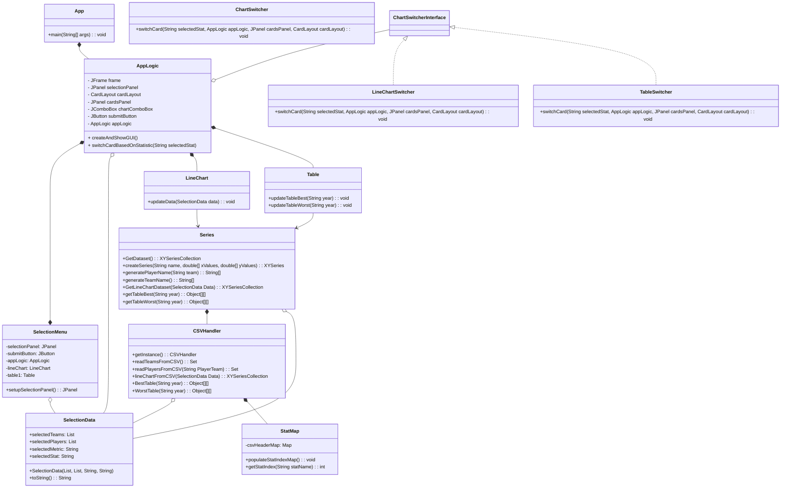

# Final Project 📖📚✍️✅💯🎓

Objectives:

In this project you will:

* Demonstrate your mastery of OOD to solve a challenging problem
* Design a solution with MVC architecture with Swing
* Apply all (or most) of the programming concepts used in this course
* Use design patterns to raise cohesion and lower coupling as well as to avoid re-inventing the wheel
* Meet objectives of prior assignments

## On Groups

This project can be completed individually or with a group of up to three (3) people. If the latter, the work done must be worthy of the additional personnel i.e. if one student could have completed this by themselves then the final grade will be halved (or by two-thirds).

## Part 1: The Idea

Think of three (3) real problems that excite you. Consider for example:

* a problem that you're encountering at work
* an issue that you run into daily in your usual routine
* a CS problem that sparks your curiosity
* a challenge from when you were an undergraduate
* a new unique game you want to develope

This project is a culmination of all of you've learned in this class including Object-Oriented Design, Testing, UML, Design Patterns, and most importantly is a showcase for MVC requiring Swing.

Should you want to do some data visualization (like with NumPy or Pandas in Python) a widely used tool for Java is [JFreeChart](https://www.jfree.org/jfreechart/samples.html) or [Figma](https://www.figma.com/). These tools are not a replacement for Swing but can be used to create mock up of what you want your final visual to look like.

If you're working with a team - each member should come up with three (3) unique ideas.

Share your ideas on a private Piazza post, visible to the Instructors and the other members of your team, *by the date recommended in Canvas*. We will discuss with you the feasiblity and difficulty of implementing each idea, raising the bar if the problem is too simple, or lowering it if too complicated. If an idea you selected already has many examples online, like on StackOverflow, we will veto it. Finally, we'll recommend to the group which idea would make for the best project. If you dislike any requirements that we add, your group can suggest new ideas until all parties are satisfied.

You cannot proceed to Part 2 until Part 1 is approved.

## Part 2: The Design

This is where you will design a UML Class Diagram that your team will submit here on this README.md written in Mermaid. Use every tool to ensure that the system that you design follows proper OOD principles, is well organized, appears highly cohesive, and lously coupled. Your use of Design Patterns needs to be indicated with UML Notes as part of the diagram.

The second half of this part is a mock-up of what you want your application to look like using a tool like [SceneBuilder](https://gluonhq.com/products/scene-builder/). Add these files to the repo and include screenshots of your renderings below.

!

No actual Java code will be written for this part. Submit everything here on GitHub by the date recommended on Canvas. The teaching teach will provide rapid feedback on your diagram and Views. You can move on to Part 3, just be aware that you may need to change things if the Teaching Team finds issues.

## Part 3: Implementation

A failure to plan is a plan to fail -- but you've done all of the planning, now is the time to build it 😎

There is also a codewalk where you will meet with the Instructors to go over your mostly completed application and get feedback all aspects, including design, Views, missing components, etc., that will need to be addressed before submitting a final result.

## Documentation and Testing

Your project needs to follow the Google style format and reach 70% code coverage from your testing on components not related to the View/Control. You are expected to show a screenshot from your JaCoCo coverage report below, identifying the level of code coverage.

## UML & Design Patterns

// add final UML Class Diagram written in Mermaid here. This is the new version of the UML but leave the old version in the earlier section.

Also fill in the table below explaining the design patterns that you used in your application.

| Pattern Name | Class(es) | Justification |
| :--------: | ------- | :------- |
| Singleton | `CSVHandler` | This pattern allowed for only 1 instance of CSV. |
| Facade | `Series` | Attempt to create a simpler interface to reading and writing to csv than having deal witht the complex CSV and other complex subsystems  |
| Strategy | `applogic` | strategy pattern implemented to use a interface and select the type of chart to generate based on input |
| Observer | `Selection Menu ` | ItemListeners employed to check for user input and bring about changes in GUI  |
| Iterator | `CSV handler` | Very common design pattern used to loop through lists maps sets etc. |

## Reflection

Each member of your group needs to provide an answer to *each* question and be sure to clearly identify whose response is whose.

1. Describe one lesson from this course and how it impacted this project.
- **Answer:** I put much thought into making sure this project will be open to extensibility and closed to modification by promoting loose coupling. secondly i applied a lot of compostion wherever possible over inheritance.
2. What part of this assignment did you find the most challenging and why?
- **Answer:** SWING gui was new to me so was the jframe learning about the libraries functions took more time than i wished
3. Assume that you are doing this project over again, what element(s) would you change and how?
- **Answer:** If i could i would try to get data of baseball from online instead of relying on .csv files that would make the project stand out more. there were a lot of features i thought in my head for this project for time limitation those i decided to forego if given a redo i would perhaps be wiser with my time.
4. How did the process of this assignment, specifically completing Part 2 before starting Part 3, impact your learning?
- **Answer:** I had to think about design patterns, composition/inheritance, extensibiity , coupiling and antipatterns when designing the overall project this made my work a lot more organized overall when i started to write code and helped me grasp how those concepts apply practically. 
5. Think back on what you knew before starting this course and what you know now. What advice would you tell your younger self having completed this project?
- **Answer:** I would advice to research and study design patterns swing Jframe early on. this would have enabled me to make a stronger project and a better developer overall!! 

## Accountability
N/A 
In this section, identify who worked on what parts.
