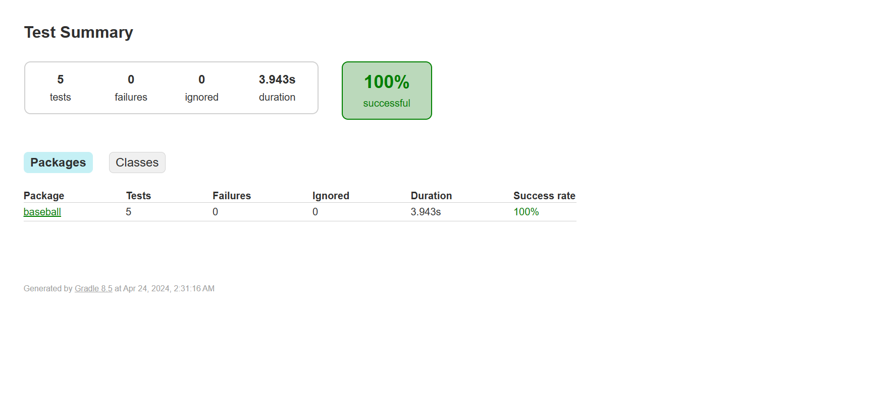
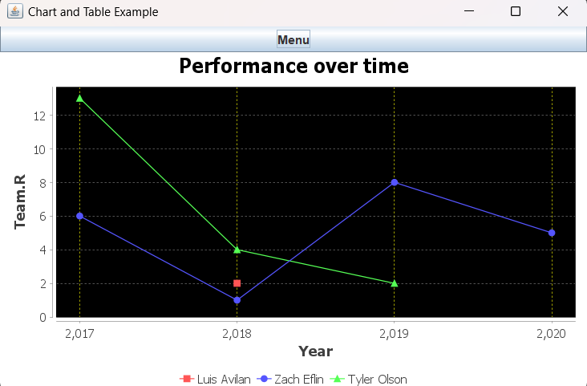
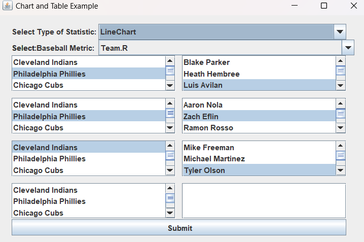
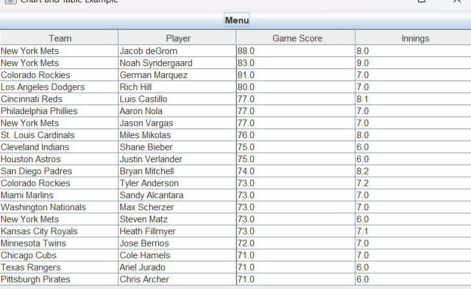

# Baseball Pitcher Data Visualization Application

  A Java Swing desktop app for exploring pitcher performance through interactive charts, sortable data views, and focused team/player analysis.

## Project Overview

This project visualizes and analyzes historical baseball pitcher statistics from CSV datasets. It was built with a strong Object-Oriented Design focus and uses the MVC architectural pattern to keep data handling, application logic, and interface concerns cleanly separated.

The result is a polished desktop application that helps users compare pitchers across seasons, inspect individual performance trends, and quickly surface top or bottom performers in a given context.

## Feature Highlights

- **Interactive visual analysis:** Explore pitcher trends with line charts and data tables that make season-over-season changes easy to spot.
- **Team and player filtering:** Narrow the view to specific teams or individual pitchers for more targeted analysis.
- **Wide stat coverage:** Review metrics such as `IP`, `ERA`, `SO`, and `GSc` across multiple seasons.
- **Best and worst performer lookup:** Surface standout and struggling pitchers using selected evaluation criteria.
- **Desktop-first workflow:** The Swing interface keeps the experience direct, fast, and easy to navigate.

## Application Gallery

  
  

  
  

These screenshots showcase the application's main analysis flow: selecting teams and pitchers, comparing stat trends, and switching between visual and tabular views.

## Technical Architecture and Design

The application follows the **Model-View-Controller (MVC)** pattern to improve maintainability, readability, and future extensibility. Several design patterns are used to support the overall structure:

| Pattern Name | Application in Project |
| :----------- | :--------------------- |
| **Singleton** | Ensures a single instance of `CSVHandler` for efficient data access. |
| **Facade** | Provides a simplified interface through `Series` for working with CSV-backed data operations. |
| **Strategy** | Used in `AppLogic` to switch between chart-rendering behaviors such as line charts and tables. |
| **Observer** | Powers UI reactions inside the selection workflow as users change filters and inputs. |
| **Iterator** | Supports efficient traversal of underlying data collections within `CSVHandler`. |

## Technologies Used

- **Programming Language:** Java
- **GUI Framework:** Java Swing
- **Charting Library:** JFreeChart
- **Data Handling:** Custom CSV parsing and management utilities
- **Build Tool:** Gradle

## Why This Project Stands Out

This project combines data visualization, desktop UI development, and clean software architecture in one cohesive application. It demonstrates practical engineering skills beyond just displaying data, including maintainable structure, reusable components, and thoughtful use of design patterns.

## Author

KMushfiqur
